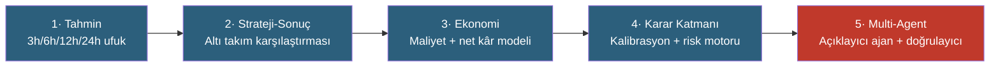
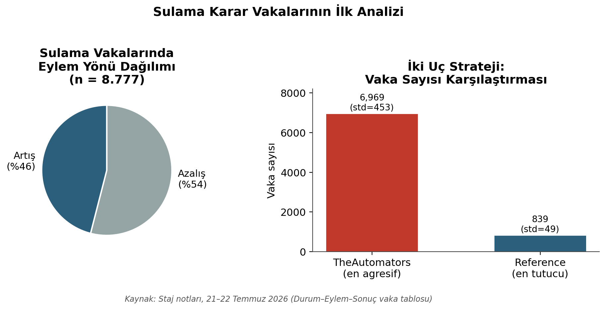
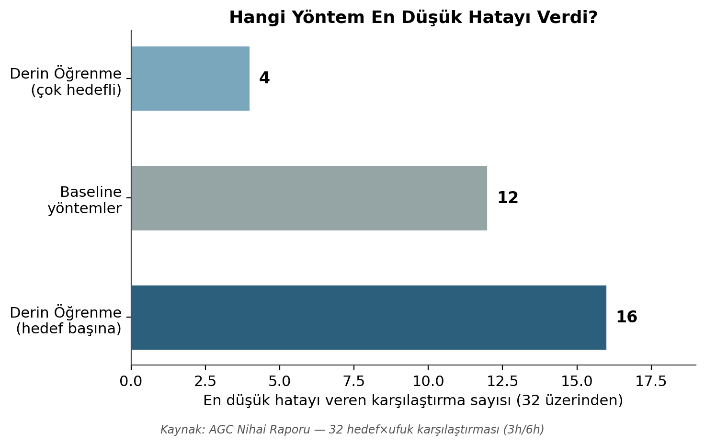
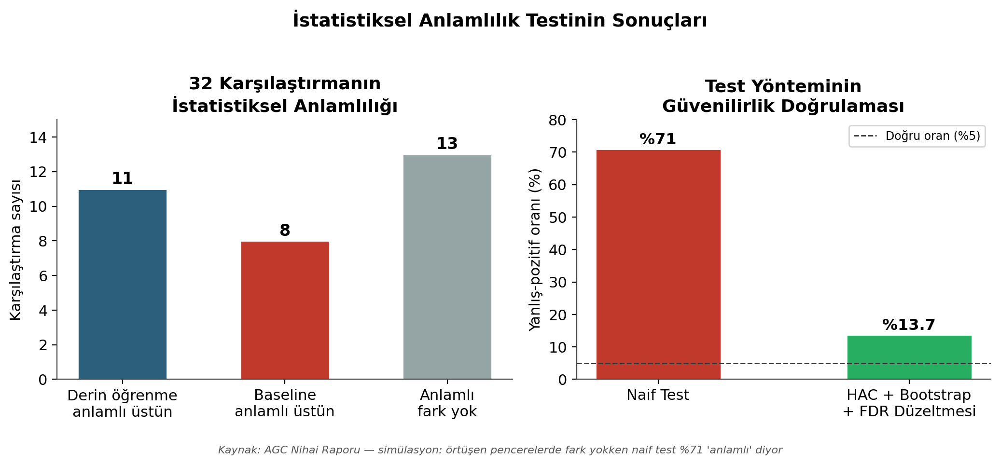
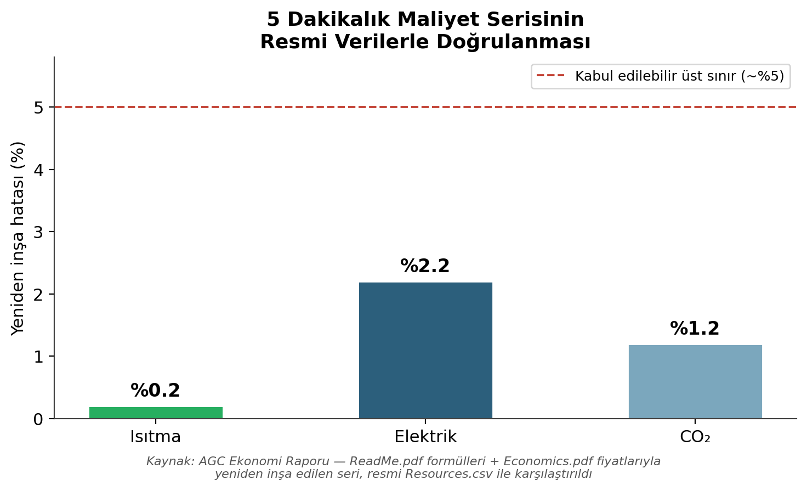
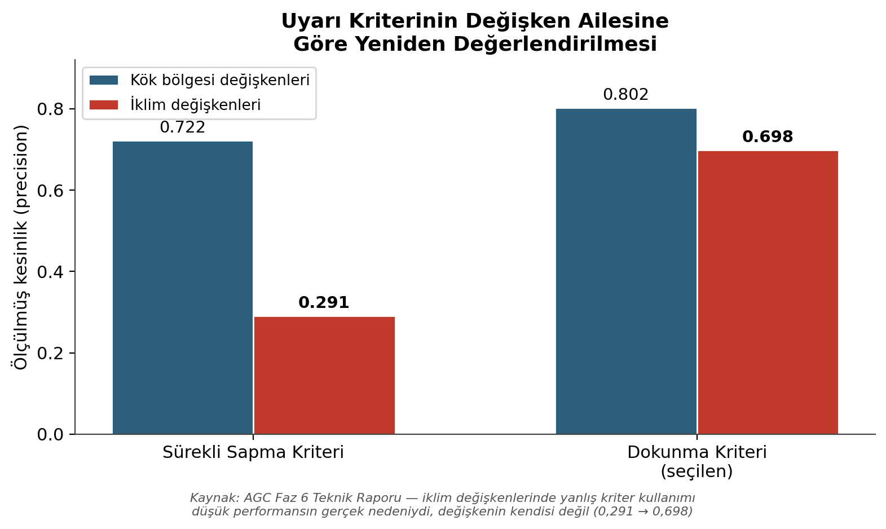
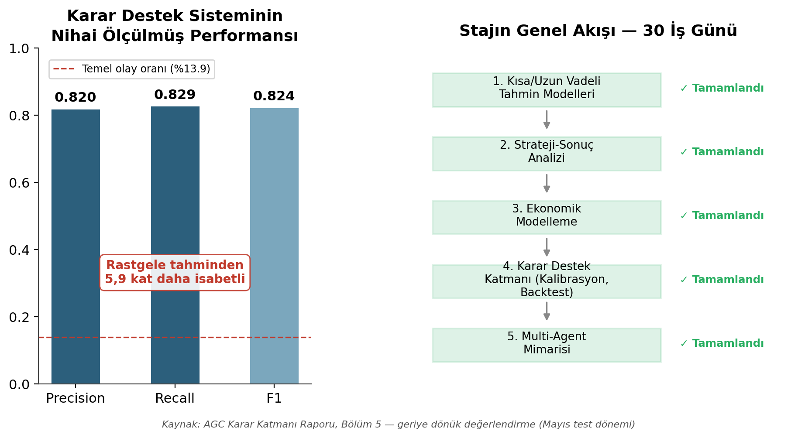

# AGC Karar Destek Sistemi

**Sera iklimi ve kök bölgesi tahmininden, kalibre edilmiş ve doğal dilde açıklanabilir bir karar destek katmanına**


Beş aşamalı bir sistem: kısa ve uzun vadeli iklim tahmini → altı sera takımının strateji-sonuç analizi → ekonomik modelleme → kalibre edilmiş bir risk/karar katmanı → bu katmanı doğal dilde açıklayan bir yapay zekâ bileşeni. [Autonomous Greenhouse Challenge, 2. Edisyon](https://data.4tu.nl/articles/_/12764777/2) veri seti üzerine kuruldu.

## İçindekiler

- [Genel bakış](#genel-bakış)
- [Mimari](#mimari)
- [Öne çıkan bulgular](#öne-çıkan-bulgular)
- [Nihai performans](#nihai-performans)
- [Depo yapısı](#depo-yapısı)
- [Kurulum](#kurulum)
- [Kullanım](#kullanım)
- [Veriye erişim](#veriye-erişim)
- [Bilinen sınırlamalar ve şeffaflık notları](#bilinen-sınırlamalar-ve-şeffaflık-notları)
- [Lisans](#lisans)
- [Atıf](#atıf)

## Genel bakış

Bu depo bir tahmin modelinden fazlasını belgeliyor: beş aşamanın her biri, bir öncekinin **ölçülerek bulunmuş** bir kusurunu düzeltti. Aynı hata deseni (bir referans değerini yanlış bir dönemle karşılaştırmak — "mevsimsel karıştırma") projede dört ayrı yerde bağımsız olarak bulunup düzeltildi; bu depo o sürecin tamamını, hatalar ve düzeltmeler dahil, saklıyor.

Sistem tek bir iddiaya dayanıyor: **her sayının bir dayanağı var.** Bir uyarı "%94 ihtimalle" diyorsa bu kalibrasyon ölçümüne dayanıyor; dayanmıyorsa sistem sessiz kalıyor. `reports/05_karar_gunlugu.md`, projenin tüm kararlarının, bulunan hataların ve düzeltmelerin kronolojik kaydıdır — en detaylı belge budur.

## Mimari



Katman 5'te karar üretimi tamamen deterministik bir çekirdekte gerçekleşir; dil modeli yalnızca üretilmiş kararı anlatır ve ürettiği her sayı, kod tabanlı bir denetleyiciyle karar kaydına karşı doğrulanır. Ayrıntı: `reports/09_faz6_multi_agent_raporu.md`.

## Öne çıkan bulgular

| Aşama | Bulgu |
|---|---|
| Tahmin | Hiçbir model ailesi (basit yöntem / derin öğrenme) her hedefte üstün değil — doğru yöntem hedefe göre değişiyor |
| Strateji | Kaynakları fiziksel birimlerle karşılaştırmak yanıltıcıydı; euro'ya çevirince ana bulgu tersine döndü |
| Ekonomi | Bir kod hatası (`iterrows()` tip bozulması) net kâr sıralamasını değiştiriyordu; düzeltilince gerçek yarışma sonucuyla birebir örtüştü |
| Karar katmanı | Yanlış uyarı kriteri iklim değişkenlerinde kesinliği %29'a düşürüyordu; kriter değişken ailesine göre ayrıştırılınca %70'e çıktı |
| Multi-Agent | Yol haritası dört ayrı ajan öngörüyordu; üç aday çatışma senaryosu ölçüldü, hiçbiri ekonomik/istatistiksel eşiği geçmedi — mimari tek açıklayıcı ajana indirgendi |

<table>
<tr><td></td>
<td></td>
<td></td></tr>
<tr><td></td>
<td></td>
<td></td></tr>
</table>

## Nihai performans

Karar destek sisteminin geriye dönük test performansı (Mayıs dönemi, test penceresi):



**Precision 0.820 · Recall 0.829 · F1 0.824** — temel olay oranından **5.9 kat** daha isabetli.

## Depo yapısı

```
reports/                     Tüm raporlar, kronolojik sırayla numaralı
├── 01_nihai_rapor_3h_6h.md          Kısa vadeli tahmin — KİLİTLİ
├── 02_strateji_sonuc_raporu.md      Sürüm 2, euro cinsinden düzeltilmiş
├── 03_ekonomi_raporu.md
├── 04_karar_katmani_raporu.md
├── 05_karar_gunlugu.md              Tam kronolojik karar kaydı
├── 06_konfigurasyon_referansi.md
├── 07_parametre_degisiklik_gunlugu.md
├── 08_uzun_vadeli_tahmin_12h_24h.md
├── 09_faz6_multi_agent_raporu.md    Multi-agent mimarisinin ölçülüp reddedildiği faz
└── archive/                         Süperseded belgeler (tarihsel referans)

src/
├── 01_forecasting/         Veri hattı, pencere üretimi, baseline'lar, derin modeller
├── 02_strategy/            Altı takımın strateji-sonuç karşılaştırması
├── 03_economics/           Maliyet serisi, net kâr hesabı, maliyet tahmini denemeleri
├── 04_decision_layer/      Kalibrasyon, karar bilgi tabanı, risk motoru — İLK SÜRÜM
└── 05_multi_agent/         GÜNCEL risk motoru + açıklayıcı ajan + sayı denetleyici

data/                       Karar bilgi tabanı ve kural güvenilirlik CSV'leri
figures/                    Rapor görselleri
```

> **Not:** `agc_risk_motoru.py` ve `agc_trajektori_ozeti.py` hem `04_decision_layer/` hem `05_multi_agent/` altında bulunur. Üretim/referans kullanımı için her zaman **`05_multi_agent/`** altındaki sürüm esas alınmalıdır; `04_decision_layer/` yalnızca projenin evrimini göstermek için tutuluyor.

## Kurulum

```bash
git clone https://github.com/ncrim7/agc-ai-research.git
cd agc-ai-research
pip install -r requirements.txt
```

Proje TensorFlow 2.10.1 / Keras 2.10.0 ile geliştirildi ve test edildi. Google Colab ve yerel bir Windows/Anaconda ortamı arasında geçiş yapıldı; Keras 2.x/3.x checkpoint uyumsuzluğu için bkz. `reports/09_faz6_multi_agent_raporu.md` Ek D.

## Kullanım

Script'ler ham veriyi `common_core_with_grodan_strict.parquet` gibi ara işlenmiş dosyalardan okur (bu depoda yok — bkz. [Veriye erişim](#veriye-erişim)). Her script'in başındaki `BASE_DIR` değişkeni kendi ortamınıza göre ayarlanmalıdır.

Önerilen okuma/çalıştırma sırası, `src/` altındaki klasör numaralarını takip eder (`01_forecasting` → `05_multi_agent`); her klasörün ürettiği ara çıktı bir sonrakinin girdisidir. Belirli bir script'in hangi kararla ve hangi girdilerle çalıştırıldığına dair ayrıntı için ilgili script'in başlığındaki tarih, `reports/05_karar_gunlugu.md`'deki aynı tarihli bölümle eşleştirilebilir.

## Veriye erişim

Ham veri bu depoda yok (boyut nedeniyle). Kaynak:

> Hemming, S.; de Zwart, F.; Elings, A.; Petropoulou, A.; Righini, I. (2020). **Autonomous Greenhouse Challenge, Second Edition (2019)**. Version 2. 4TU.ResearchData. [doi:10.4121/uuid:88d22c60-21b3-4ea8-90db-20249a5be2a7](https://doi.org/10.4121/uuid:88d22c60-21b3-4ea8-90db-20249a5be2a7) · Lisans: **CC0**

## Bilinen sınırlamalar ve şeffaflık notları

Bu proje hiçbir bulguyu gizlememe ilkesiyle yürütüldü. Bilinen, henüz düzeltilmemiş sorunlar:

**1. `01_nihai_rapor_3h_6h.md` Ek B.3'te sayısal hata** (rapor kilitli, ana metne dokunulmadı):

| Satır | Raporda | Doğrulanan |
|---|---|---|
| Naif Diebold-Mariano | 26 / 32 | **29 / 32** |
| HAC + blok bootstrap + FDR | 16 / 32 | **19 / 32** |

Anlatı doğru kalmış (her iki çiftin farkı da 10), mutlak sayılar erken bir koşudan kopyalanıp güncellenmemiş. §4.4'ün kendisi (13 fark yok / 11 derin / 8 baseline) bağımsız olarak yeniden doğrulandı.

**2. Reproducibility notu.** `src/01_forecasting/agc_anlamlilik.py`'yi varsayılan girdiyle çalıştırmak §4.4'ten farklı bir sonuç (17/3/12) üretir. Rapor, iki ayrı sonuç dosyasının (analitik baseline'lar + Ridge) birleştirilmesiyle üretildi; bu birleştirme adımı ayrı bir script olarak kayıtlı değil. Farklı bir sayı almanız hata değil, eksik bir girdi adımına işarettir.

**3. `data/decision_knowledge_base_v3.csv` mevsim ayrımı yapmıyor.** `decision_knowledge_base_v5.csv`'de düzeltildi (mevsimsel dengesizlik 153.6× → 1.5×). `v3` yalnızca tarihsel referans içindir, kullanılmamalıdır.

## Lisans

Kod: [MIT](LICENSE). Veri seti: CC0 (Wageningen University & Research — bkz. [Veriye erişim](#veriye-erişim)).

## Atıf

Bu depoyu kullanırsanız, lütfen hem bu depoya hem de orijinal veri setine atıf verin (yukarıdaki DOI).

---

*20 Temmuz – 28 Ağustos 2026 tarihleri arasında 30 iş günlük bir staj çalışmasının ürünüdür.*
