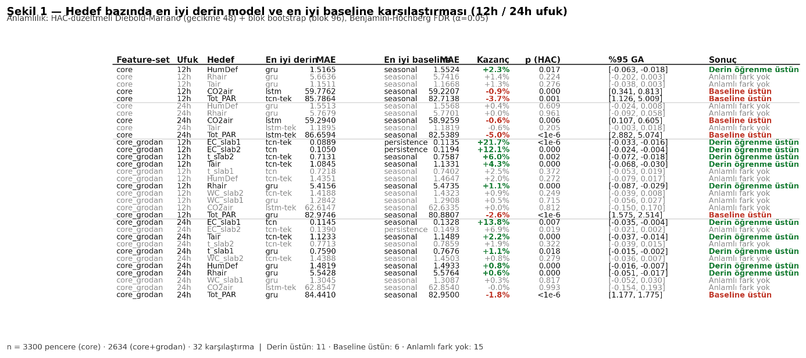

**Sera İkliminde Uzun Vadeli Tahmin**

**12 ve 24 Saatlik Ufuklarda Baseline ve Derin Öğrenme Karşılaştırması**

**Tarih:** Ağustos 2026 · **Kapsam:** AGC 2. Edisyon — uzun ufuk çalışması **İlişki:** Bu rapor, *Sera İkliminde Kısa Vadeli Tahmin* (3h/6h) raporunun devamıdır. O raporun hiçbir sayısı değişmemiştir.

**Bu belge nasıl okunmalı:** Ana gövde (1–6. bölümler) teknik ön bilgi gerektirmez. Ekler (A–E), sorulması muhtemel teknik soruların ayrıntılı cevaplarını içerir.

**ANA GÖVDE**

**1. Özet**

Önceki çalışma "önümüzdeki 3 ve 6 saatte sera ne durumda olacak" sorusunu cevaplamıştı. Bu çalışma aynı soruyu **12 ve 24 saat** için soruyor.

Bunun pratik önemi şu: 6 saatlik tahmin bir operatörün vardiyası içindir. 24 saatlik tahmin ise **planlama** içindir — yarınki enerji alımı, sulama programı, iş gücü dağılımı.

**Ana sonuç: ufuk uzadıkça basit yöntemler güçlenir, ama bir istisna vardır ve bu istisna öğreticidir.**

| **Bulgu**                                          | **Açıklama**                                                                                                       |
|----------------------------------------------------|--------------------------------------------------------------------------------------------------------------------|
| "Dün bu saatte" yöntemi 24 saatte de bozulmuyor    | Hava sıcaklığında hata 3 saatten 24 saate yalnızca %1,5 artıyor. Işıkta ve CO₂'de hiç artmıyor.                    |
| Derin öğrenmenin katkısı ilk 3 saatte yoğunlaşıyor | 3 saatten sonra model, basit tahmine eklediği düzeltmeyle fayda değil zarar veriyor                                |
| **Kök bölgesi tuzluluğu ters yönde davranıyor**    | 3 saatte basit yöntem kazanıyordu; **12 saatte derin öğrenme %21,7 üstün.** Tek bulgu değil, bir örüntünün parçası |
| Yeni bir seraya taşınabilirlik ikiye ayrılıyor     | Hava tahmini %1–3 bedelle taşınıyor; kök bölgesi %10–27 bedelle                                                    |

**Bir cümlelik yönetici özeti:** 24 saatlik iklim tahmini için derin öğrenmeye gerek yok; kök bölgesi kimyası için gerekli, ama o modelin her seraya ayrı kurulması gerekiyor.

**2. Ne yapıldı**

**2.1 Neden ayrı bir model ailesi**

Mevcut modeller 6 saatlik çıktı üretiyordu. İki seçenek vardı:

1.  Aynı modeli 24 saat çıktı üretecek şekilde yeniden eğitmek

2.  Ayrı bir model ailesi kurmak, mevcut modelleri korumak

**İkincisi seçildi.** Gerekçesi çalışma sırasında ölçüldü ve doğrulandı: 24 saatlik çıktıya zorlanan model, kısa ufukta belirgin şekilde zayıflıyor (Ek A.3). Tek aile kullanılsaydı önceki raporun sonuçları geçersizleşirdi.

**2.2 Kurulum**

|                        | **Değer**                                            |
|------------------------|------------------------------------------------------|
| Girdi                  | Son 24 saat (288 ölçüm) — önceki çalışmayla **aynı** |
| Çıktı                  | Sonraki 24 saat (288 ölçüm); 12 saat = ilk yarısı    |
| Test penceresi         | Core 3.300 · Core+Grodan 2.634                       |
| Karşılaştırılan yöntem | 5 basit yöntem + 3 derin model (54 eğitim koşusu)    |
| Çapraz doğrulama       | 36 koşu (her sera bir kez dışarıda)                  |

Girdinin 24 saatte sabit tutulması bir tercih değil, zorunluluk: modelin düzeltme yaptığı referans tahmin ("dün bu saatte") tam olarak bu 24 saatin içinden okunuyor. Daha kısa girdi, modelin göremediği bir veriyi düzeltmesi anlamına gelirdi.

**2.3 Ölçülen bedel**

Ufuk uzayınca her pencere daha fazla veri kaplıyor, dolayısıyla birbirinden bağımsız pencere sayısı azalıyor:

|                            | **6 saatlik ufuk** | **24 saatlik ufuk** |
|----------------------------|--------------------|---------------------|
| Bağımsız örnek             | 552                | **348** (−%37)      |
| Eğitim penceresi (nominal) | 2.759/sera         | 2.741/sera (−%0,7)  |

Dikkat çekici olan ikinci satır: **eğitim maliyeti neredeyse aynı kalıyor ama gerçek bilgi üçte bir azalıyor.** Bu, uzun ufuk çalışmalarının gizli maliyetidir ve sonuçların yorumunda göz önünde tutulmalıdır (Ek D.1).

**2.4 Değiştirilen tek tasarım kararı**

Derin model, basit bir referans tahmine düzeltme ekler. Kök bölgesi su içeriği için önceki çalışmada referans "şu anki değer devam edecek" idi. 24 saatte bu referans çöküyor:

| **WC_slab1 referansının hatası** | **3 saat** | **24 saat** |
|----------------------------------|------------|-------------|
| "Şu anki değer devam edecek"     | 1,087      | **3,025**   |
| "Dün bu saatte ne vardıysa"      | 1,287      | **1,309**   |

24 saatte aradaki fark 2,3 kat. Referans, uzun ufuk için "dün bu saatte" olarak değiştirildi. Kök tuzluluğunda ise eski referans korundu — orada değişim gerekçesi oluşmadı.

Bu değişikliğin bir bedeli var ve şeffaf olmak gerekir: referansı iyileştirmek, derin modelin kazanacağı payı da daralttı. Su içeriği hedeflerinde 24 saatte anlamlı fark çıkmamasının sebebi kısmen budur.

**3. Sonuçlar**

**3.1 Genel tablo**

32 hedef–ufuk kombinasyonunun tamamı istatistiksel olarak test edildi:

| **Sonuç**                   | **Sayı** |
|-----------------------------|----------|
| Derin öğrenme anlamlı üstün | **11**   |
| Baseline anlamlı üstün      | 6        |
| Anlamlı fark yok            | 15       |

Önceki çalışmada (3h/6h) bu dağılım 11 / 8 / 13 idi. Sayılar benzer görünüyor, **ama içerik tamamen değişti.**

**3.2 En büyük değişim: kök bölgesi tuzluluğu**

Önceki rapor şöyle diyordu: *"Kök tuzluluğu o kadar yavaş değişiyor ki 'hiçbir şey olmayacak' en iyi tahmin."*

Dört ufukta aynı hedefe bakalım:

| **EC_slab1** | **En iyi basit yöntem** | **En iyi derin model** | **Sonuç**                |
|--------------|-------------------------|------------------------|--------------------------|
| 3 saat       | 0,0436                  | 0,0476                 | **Basit yöntem üstün**   |
| 6 saat       | 0,0719                  | **0,0656**             | Derin üstün (+%8,8)      |
| **12 saat**  | 0,1135                  | **0,0889**             | **Derin üstün (+%21,7)** |
| 24 saat      | 0,1328                  | **0,1145**             | Derin üstün (+%13,8)     |

İkinci sensör (EC_slab2) aynı yerde dönüyor: 3 saatte basit yöntem, 12 saatte derin öğrenme %12,1 üstün.

**Neden:** 3 saatte referans tahmin neredeyse kusursuz (hata 0,044) — modele öğrenecek bir şey bırakmıyor. 24 saatte aynı referans 3,1 kat bozuluyor (0,136) ve arada bir boşluk açılıyor. Model o boşluğu dolduruyor.

Önceki rapor yanlış değil, **eksik**: gözlemini kendi ufkunun ötesine genellemişti. Kök ortamı gerçekten bir tampon gibi davranıyor — ama tamponun bir zaman sabiti var ve 6 saatin ötesinde etkisi tükeniyor.

📊 **Şekil 1** — 32 karşılaştırmanın tamamı

**3.3 Genel ilke: kazanç, referansın bıraktığı boşlukla orantılı**

Yukarıdaki örnek tek başına durmuyor. Tüm hedeflere bakınca net bir örüntü çıkıyor:

| **Hedef**               | **Referansın 3h → 24h bozulması** | **Derin modelin 24h kazancı** |
|-------------------------|-----------------------------------|-------------------------------|
| EC_slab1                | 3,1 kat                           | **+%13,8**                    |
| t_slab1 (kök sıcaklığı) | 1,8 kat                           | +%1,1                         |
| Tair (hava sıcaklığı)   | 1,05 kat                          | +%2,2                         |
| CO₂                     | 1,02 kat                          | −%0,0                         |
| Tot_PAR (ışık)          | 1,11 kat                          | **−%1,8**                     |

Referans düz kaldığı yerde — yani güneşin günlük döngüsüne kilitli her şeyde — öğrenilecek yapı yok. Referans bozulduğu yerde var.

Bu, "hangi hedefe derin model kurmalı" sorusunun genel cevabıdır ve başka veri setlerine de taşınabilir bir ilkedir.

**3.4 Basit yöntemler neden bu kadar dayanıklı**

"Dün bu saatte" yönteminin hatası ufukla neredeyse hiç artmıyor:

| **Hedef**      | **3 saat** | **24 saat** | **Değişim** |
|----------------|------------|-------------|-------------|
| Hava sıcaklığı | 1,165      | 1,183       | **+%1,5**   |
| CO₂            | 59,43      | 58,92       | **−%0,9**   |
| Işık           | 82,87      | 82,50       | **−%0,5**   |

CO₂ ve ışıkta hata 24 saatte **azalıyor**. Sebep: 24 saat tam bir günlük döngü. Referans tam olarak aynı saat dilimine oturuyor.

Karşılaştırma için "şu anki değer devam edecek" yöntemi aynı aralıkta 3 kat bozuluyor (1,389 → 4,167).

**3.5 Derin modelin düzeltmesi nerede işe yarıyor**

Hava sıcaklığı için, tahmin ufkunu dilimlere ayırdığımızda:

| **Zaman dilimi** | **Derin model** | **"Dün bu saatte"** | **Fark**  |
|------------------|-----------------|---------------------|-----------|
| 0–3 saat         | **1,128**       | 1,165               | **+%3,1** |
| 3–6 saat         | 1,171           | 1,167               | −%0,3     |
| 6–12 saat        | 1,196           | 1,167               | −%2,5     |
| 12–24 saat       | 1,222           | 1,199               | −%1,9     |

**Model yalnızca ilk 3 saatte katkı sağlıyor; sonrasında zarar veriyor.**

Sebep tasarımda: model 24 saatlik düzeltmenin tamamını tek seferde üretiyor. Düzeltmenin ufka göre sönümlenmesi için hiçbir mekanizma yok. Uzak adımlarda referans zaten en iyisi — oraya eklenen her şey gürültü.

Bu, mimari bir sınırlamadır ve gelecekteki çalışma için en somut iyileştirme yönüdür (Ek E).

**3.6 Hangi model kazanıyor**

Önceki rapor kesin konuşuyordu: *"TCN her koşulda en iyisidir."* 24 saatte durum farklı:

| **Mimari** | **16 hedefin kaçında en iyi** |
|------------|-------------------------------|
| GRU        | **7**                         |
| TCN        | 5                             |
| LSTM       | 4                             |

TCN'in üstünlük gerekçesi, girdi penceresinin **başındaki** bilgiyi görebilmesiydi — yani "dün bu saatte ne vardı". 24 saatlik çıktıda o bilgi zaten referansın içinde. TCN'in yapısal avantajı tüketilmiş oluyor.

Benzer şekilde, hedef başına ayrı model eğitmenin faydası da azalıyor: önceki çalışmada 32 hedefin 24'ünde iyiydi, burada 16 hedefin 7'sinde.

**4. Yeni bir seraya taşınabilirlik**

Önceki rapor sistemin hiç görmediği bir seraya **%2–5 bedelle** kurulabildiğini göstermişti. 24 saatlik ufukta bu ikiye ayrılıyor:

| **Hedef**                    | **Taşınma bedeli (24 saat)** |
|------------------------------|------------------------------|
| **Kök tuzluluğu (EC_slab1)** | **+%26,6**                   |
| Kök suyu (WC_slab2)          | +%26,0                       |
| Kök suyu (WC_slab1)          | +%23,8                       |
| Kök tuzluluğu (EC_slab2)     | +%16,2                       |
| Kök sıcaklığı (t_slab1)      | +%10,5                       |
| Işık                         | +%3,2                        |
| Bağıl nem                    | +%1,8                        |
| Hava sıcaklığı               | +%1,6                        |
| Nem açığı                    | +%1,4                        |
| CO₂                          | +%1,1                        |

Ayrım keskin: **kök bölgesi %10–27, hava %1–3.**

**Hava fiziği her ufukta evrenseldir; kök bölgesi ufuk uzadıkça takıma özgüleşir.**

Bu mantıklı: hava sıcaklığını dış hava, radyasyon ve havalandırma belirler — bunlar tüm seralarda aynı fizik. Kök bölgesini ise sulama politikası belirler ve bu takıma özgü bir karardır.

**4.1 Rapora girmesi gereken gerilim**

| **EC_slab1 (24 saat)**                | **Değer**                    |
|---------------------------------------|------------------------------|
| Derin modelin basit yönteme üstünlüğü | **+%13,8** — en büyük kazanç |
| Yeni seraya taşıma bedeli             | **+%26,6** — en yüksek bedel |

**Derin öğrenmenin en çok kazandırdığı hedef, aynı zamanda yeni bir seraya en kötü taşınan hedeftir.** Kazanç takıma özgüdür.

Pratik sonuç: EC tahmini için derin model kurmak, o serada önce veri toplamayı gerektirir. Sıfırdan kurulumda kazanç, bedelin altında kalır.

**5. Sonuç ve öneriler**

**5.1 Hedefe özgü strateji — 24 saatlik ufuk için**

| **Ne tahmin ediliyor**         | **Önerilen yöntem**                  | **Gerekçe**                                                    |
|--------------------------------|--------------------------------------|----------------------------------------------------------------|
| Hava sıcaklığı, nem, CO₂, ışık | **"Dün bu saatte"** (Seasonal Naive) | Hesaplama maliyeti sıfır; derin model anlamlı katkı sağlamıyor |
| Kök bölgesi tuzluluğu          | **Derin model (TCN)**                | %14–22 kazanç — ama o seraya özel eğitim gerekir               |
| Kök bölgesi suyu, sıcaklığı    | **"Dün bu saatte"**                  | Referans değişikliğinden sonra derin model üstünlüğü kalmadı   |

Önceki çalışmanın kısa ufuk önerileri geçerliliğini korur; bu tablo yalnızca 12–24 saatlik planlama içindir.

**5.2 Operasyonel çıkarım**

24 saatlik iklim planlaması için pahalı altyapıya gerek yok. Son 24 saatin verisini saklayan basit bir sistem, derin öğrenmeyle aynı doğrulukta tahmin üretir.

Yatırım yalnızca **kök bölgesi kimyası** için anlamlıdır ve orada da her sera için ayrı veri toplama ve eğitim gerekir.

**5.3 Negatif sonuç da sonuçtur**

Bu çalışmanın çıktısının büyük kısmı "derin öğrenme kazanmıyor" biçimindedir. Bu bir başarısızlık değildir: 32 karşılaştırmanın tamamı önceden belirlenmiş bir protokolle test edilmiş, sonuçlar istatistiksel olarak doğrulanmıştır. **Bir yöntemin nerede işe yaramadığını bilmek, nerede işe yaradığını bilmek kadar değerlidir** — çünkü gereksiz yatırımı önler.

**EKLER**

**Ek A — Metodolojik notlar**

**A.1 İstatistiksel anlamlılık**

Test pencereleri birbiriyle örtüşür (her pencere 1 saat arayla üretilir, 48 saatlik veri kapsar). Bu, standart anlamlılık testlerinin varsayımını ihlal eder.

Önceki çalışmadaki düzeltme burada da uygulandı, ancak **parametreler ufka göre yeniden türetildi**:

|                        | **6 saatlik ufuk** | **24 saatlik ufuk** |
|------------------------|--------------------|---------------------|
| Örtüşen pencere sayısı | 30                 | **48**              |
| HAC gecikmesi          | 30                 | **48**              |
| Bootstrap blok boyutu  | 60                 | **96**              |

Türetim: (girdi 288 + çıktı 288) / kaydırma 12 = 48.

Bu düzeltme yapılmasaydı varyans eksik tahmin edilir ve test fazla sayıda "anlamlı" sonuç üretirdi — yani önceki raporun temel metodolojik bulgusunun aynısı tekrarlanırdı.

**A.2 Düzeltmenin etkisi tekrar doğrulandı**

| **Test**               | **Anlamlı bulunan** |
|------------------------|---------------------|
| Naif (düzeltmesiz)     | 26 / 32             |
| HAC düzeltmeli         | 18 / 32             |
| Blok bootstrap         | 17 / 32             |
| **Nihai (üçü birden)** | **17 / 32**         |

Naif test **9 fazladan** "anlamlı" üretiyor. Önceki çalışmada bu sayı 10'du. Bulgu bağımsız bir ufukta replike edilmiştir.

**A.3 Kısa ufuk bedeli ölçüldü**

Yeni model ailesi 3 ve 6 saatlik dilimlerde de değerlendirildi (teşhis amaçlı, ayrı bir istatistiksel gruba konularak):

| **3h + 6h, 32 karşılaştırma** | **Derin** | **Baseline** | **Fark yok** |
|-------------------------------|-----------|--------------|--------------|
| Önceki aile (6 saat çıktı)    | **11**    | 8            | 13           |
| Yeni aile (24 saat çıktı)     | **7**     | 7            | 18           |

**Kısa ufuk bedeli: 4 derin galibiyet.** Bölüm 2.1'deki tasarım kararı doğrulanmıştır: iki aileyi ayrı tutmak gerekliydi.

*(Not: iki ailenin test pencereleri tamamen aynı değildir — uzun pencere için 550, kısa için 568 pencere/sera. Karşılaştırma gösterge niteliğindedir.)*

**A.4 Doğruluk kontrolü**

24. saatte "dün bu saatte" tahmini matematiksel olarak "şu anki değer devam edecek" tahminine eşittir. Kod bu özdeşliği **0,000e+00** farkla üretmiştir — kayan nokta hatası bile yok. Baseline implementasyonu doğrudur.

Ayrıca yeni hattın 3 saatlik sonuçları, önceki raporun sayılarıyla bağımsız olarak örtüşmektedir (EC_slab1: 0,0436 vs rapor 0,043).

**Ek B — Ek analiz: yarışmayı kazanan seranın profili**

Önceki rapor şunu söylüyordu:

*"Automatoes en zor genellenen seradır — ve yarışmanın kazananıdır. En ayırt edici kontrol politikasına sahip olan, diğerlerinden öğrenen bir model için en öngörülemez olanıdır."*

Bu bir çıkarımdı, kanıt değildi. Test edildi.

**B.1 Sulama politikası — hipotez desteklenmedi**

Her seranın sulama profili çıkarıldı (günlük hacim, olay sayısı, olay başına hacim, gün içi dağılım) ve her sera diğer beşinin dağılımına göre standartlaştırıldı.

| **Sera**       | **Sulama ayırt ediciliği**   | **Genelleme zorluğu** |
|----------------|------------------------------|-----------------------|
| **Automatoes** | **0,44 — en az ayırt edici** | **1,31 — en zor**     |
| TheAutomators  | 0,93                         | 1,10                  |
| **Digilog**    | **1,92 — en ayırt edici**    | 1,01 — ortalama       |
| Reference      | 1,49                         | 0,90                  |
| AICU           | 0,99                         | 0,83                  |
| IUACAAS        | 0,74                         | 0,86                  |

Sıralama korelasyonu −0,31. **İlişki yok, hatta hafif ters.** Automatoes tam ortalama sulama yapmaktadır.

**Yan bulgu:** Sulama *zamanlaması* altı takımda pratikte aynıdır (ilk sulama ~02:30, son ~22:55, pencere ~20 saat). Ayrışma tamamen **hacimdedir**: Reference günde 9.099 birim, AICU 4.600 — iki kat fark. Takımlar ne zaman sulayacaklarını değil, ne kadar sulayacaklarını farklı kararlaştırmışlardır.

**B.2 İklim kontrolü — Automatoes gerçekten ayrıksı, ama başka boyutta**

Aynı ölçüm iklim kontrol komutlarına uygulandığında toplam ayırt edicilik yine ilişkisiz çıkıyor (korelasyon +0,37, Automatoes 3/6). Ancak **tek tek özniteliklere** bakıldığında tablo değişiyor:

| **Kontrol davranışı**             | **Automatoes** | **Diğer 5 ortalaması** |
|-----------------------------------|----------------|------------------------|
| Havalandırma açma eşiği           | **30,7 °C**    | 22,3 °C                |
| Pencere açıklığı (ortalama)       | **7,2**        | 11,0                   |
| Rüzgâr tarafı açıklık             | **3,7**        | 6,2                    |
| Pencere konumu değişkenliği       | **12,3**       | 0,8                    |
| Gündüz/gece eşik farkı            | **0,2**        | 4,9                    |
| Isıtma boru sıcaklığı gündüz/gece | **−9,8**       | +9,3                   |

Özet: **Automatoes az havalandırıyor, çok modüle ediyor, gece ısıtıyor ve gündüz/gece ayrımı yapmıyor.** Diğer beş sera konvansiyoneldir; Automatoes değildir. Ve yarışmayı o kazanmıştır.

Toplam ayırt edicilik ölçütünün bunu kaçırmasının sebebi seyreltmedir: 66 öznitelikten yalnızca 4'ünde uç sapma var, kalanında ortalama davranış.

**B.3 Ama zorluk havada değil, kökte**

Havalandırma hava sıcaklığını ve nemi sürer. Eğer açıklama bu olsaydı, zorluk hava hedeflerinde yoğunlaşırdı:

| **Automatoes'un normalize zorluğu** | **Hava hedefleri** | **Kök hedefleri** |
|-------------------------------------|--------------------|-------------------|
| 3 saatlik ufuk                      | 1,13               | **1,46**          |

24 saatlik ufukta fark daha da açılıyor: kök suyu hedeflerinde Automatoes diğer beşin **2,0–2,6 katı** hataya sahip.

Havalandırma açıklaması da desteklenmemektedir.

**B.4 Ayakta kalan tek gözlem**

| **Sera**       | **Ortalama kök suyu içeriği** |
|----------------|-------------------------------|
| **Automatoes** | **71,95**                     |
| TheAutomators  | 76,71                         |
| Digilog        | 79,20                         |
| AICU           | 79,38                         |
| IUACAAS        | 82,94                         |
| Reference      | 85,41                         |

Automatoes slab'ı belirgin şekilde **daha kuru** tutmaktadır — en yakın rakipten 4,8 puan, en yaşından 13,5 puan aşağıda. Günlük su tükenmesi de en yüksektir (9,62).

Bu, B.1'in neden başarısız olduğunu açıklar: **ne kadar su verildiği** ortalamaydı, ama **slab'ın hangi doygunlukta tutulduğu** ortalama değildir.

Bahçecilikte bilinen bir strateji buna karşılık gelir: daha kuru kök bölgesi bitkiyi vejetatif büyümeden meyve üretimine yönlendirir. **Bu veriyle uyumlu bir hipotezdir, kanıtlanmış bir mekanizma değildir.**

**B.5 Sonuç**

Önceki raporun açıklaması sulama veya havalandırma boyutunda doğrulanamamıştır. Automatoes'un genelleme zorluğunun mekanizması **bilinmemektedir**. Kuru slab rejimi en güçlü adaydır ancak nedensellik gösterilememiştir.

Altı sera üzerinden yapılan bu karşılaştırmalar **betimseldir**; örneklem sayısı istatistiksel çıkarıma izin vermez.

**Ek C — Çapraz doğrulama tasarımına ilişkin bir uyarı**

Önceki raporun Ek D'si, altı seranın aynı dış hava verisini paylaşmasından doğan bir tuzağı ele alıyor ve iki test seti kullanıyordu:

- **Test A:** yalnızca kontrol politikası görülmemiş (hava görülmüş)

- **Test B:** hem politika hem hava görülmemiş — "dürüst ölçüm"

İkisinin oranı (B/A), ortak-hava sızıntısının büyüklüğü olarak yorumlanmıştı. **Bu yorum düzeltilmelidir.**

Kanıt: CO₂ için B/A = **0,93** ve **0,98** — birden küçük. Saf sızıntı ölçüsü olsaydı bu mümkün olmazdı.

Sebep tasarımdadır: Test A held-out seranın **eğitim** bölmesinden (Aralık–Nisan), Test B **test** bölmesinden (Mayıs) alınır. Yani oran, hava görülmüşlüğüyle birlikte **mevsim farkını** da ölçmektedir.

Doğrulama:

| **Hedef** | **B/A oranı** | **Önceki raporun mevsimsel kayması** |
|-----------|---------------|--------------------------------------|
| Işık      | 2,01–2,05     | **2,05 kat**                         |
| Nem açığı | 2,23–2,34     | 1,46 kat                             |

Işıkta iki sayı birebir aynıdır — oran neredeyse tamamen mevsimden gelmektedir.

**Bu bir kod hatası değil, bir yorum düzeltmesidir.** Test B'nin dürüst ölçüm olması etkilenmez; yalnızca B/A oranı sızıntı büyüklüğü olarak okunamaz.

**Ek D — Bilinen sınırlamalar**

**D.1 Model kapasitesi / bağımsız örnek oranı**

24 saatlik çıktı, modelin çıktı katmanını dört kat büyütür. Aynı anda bağımsız örnek sayısı %37 azalır:

|                       | **6 saatlik ufuk** | **24 saatlik ufuk** |
|-----------------------|--------------------|---------------------|
| Parametre (TCN, core) | 18.120             | **36.480**          |
| Bağımsız örnek        | 552                | **348**             |
| **Oran**              | **33**             | **105**             |

Core+Grodan konfigürasyonunda oran 244'e kadar çıkmaktadır.

Gözlemlenen sonuç: modeller **3. eğitim turunda** en iyi doğrulama sonucunu vermekte, sonrasında ezberlemeye başlamaktadır. Yani raporlanan modeller çok kısa süre eğitilmiş modellerdir.

Model boyutu önceki çalışmadan devralınmış ve karşılaştırılabilirlik için değiştirilmemiştir. Kapasite ayarlaması bu ufuk için ayrı bir çalışma konusudur.

**D.2 Mevsimsel dağılım kayması**

Önceki raporun sınırlaması burada da geçerlidir: eğitim kışı, test ilkbaharı kapsar. Doğrulama hatası daha ilk eğitim turunda eğitim hatasının 2,3 katıdır — bu ufuktan bağımsız, yapısal bir farktır.

**D.3 Etki büyüklüğü ile anlamlılık ayrışması**

11 "derin öğrenme üstün" sonucunun yalnızca 5'i pratik olarak anlamlı büyüklüktedir:

| **Etki** | **Hedef sayısı** |
|----------|------------------|
| ≥ %4     | 5                |
| %2–3     | 2                |
| \< %1,5  | 4                |

Örnek: nem açığında 24 saatte kazanç **%0,8** ama istatistiksel anlamlılık son derece yüksek. Sebep, düzeltmenin 2.634 pencerenin hepsinde aynı yönde olması — fark küçük ama tutarlı.

**Küçük p-değeri, önemli sonuç demek değildir.** Önceki rapor bunun tersini (büyük yüzde ≠ güvenilir sonuç) uyarıyordu; bu çalışma simetriğini göstermektedir. Raporlamada %2 altındaki farklar "saptanabilir ama operasyonel olarak önemsiz" olarak ayrılmalıdır.

**D.4 Tek sezon, tek tesis, tek ürün**

Önceki raporun sınırlaması aynen geçerlidir. Ek olarak: 24 saatlik ufuk tek bir günlük döngüyü kapsar; çok günlük örüntüler test edilmemiştir.

**Ek E — Gelecek çalışma**

Öncelik sırasıyla:

1.  **Ufka göre sönümlenen düzeltme.** Bölüm 3.5'in bulgusu doğrudan bir mimari öneriye dönüşür: model, düzeltmesini uzak adımlarda sıfıra yaklaştırmalıdır. En somut ve en ucuz iyileştirme.

2.  **Çıktı katmanının yeniden tasarımı.** Ek D.1'deki oran sorunu çıktı katmanından kaynaklanmaktadır. Adım adım üretim (autoregressive) veya düşük boyutlu temsil bu yükü kaldırabilir.

3.  **48 saatlik girdi denemesi.** Model günden güne farkı öğrenmektedir; bunun en doğrudan bilgisi bir önceki günden güne farktır ve şu anki girdi bunu göremez. Bedeli %34 daha az bağımsız örnektir; kontrollü tek bir ablasyonla ölçülmelidir.

4.  **Kök bölgesi için sera-özgü eğitim protokolü.** Bölüm 4.1'deki gerilim, "ne kadar veri toplandıktan sonra derin model kârlı hale gelir" sorusunu doğurur. Pratik değeri yüksektir.

**Şekil listesi**

| **No** | **Şekil**                                                     | **Nerede** |
|--------|---------------------------------------------------------------|------------|
| 1      | Hedef bazında en iyi derin model ve en iyi baseline (12h/24h) | Bölüm 3    |

