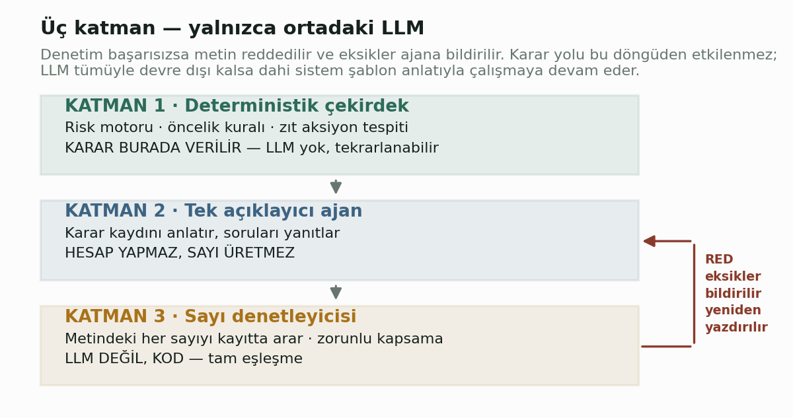
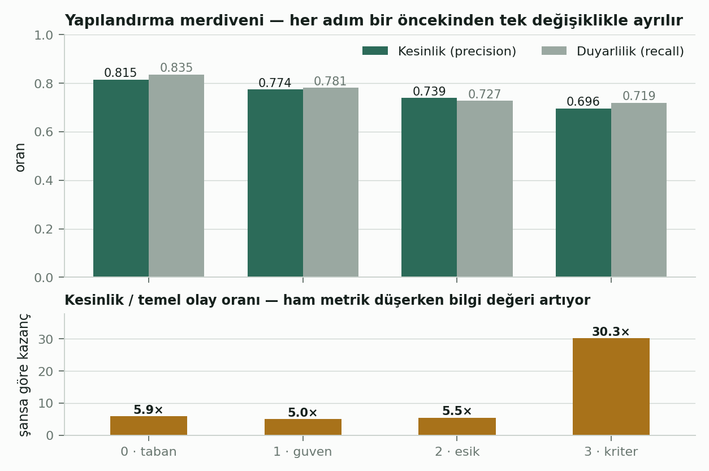
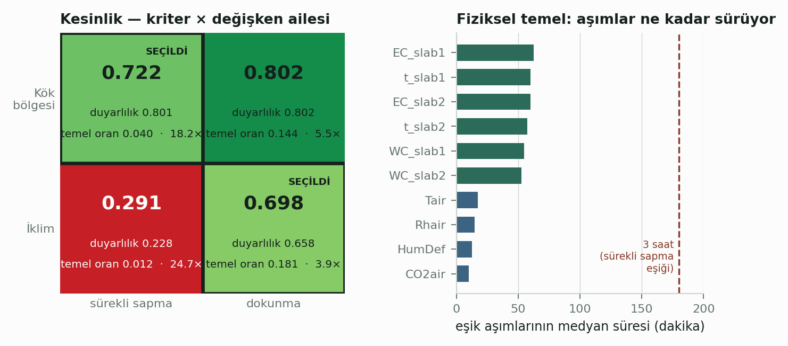
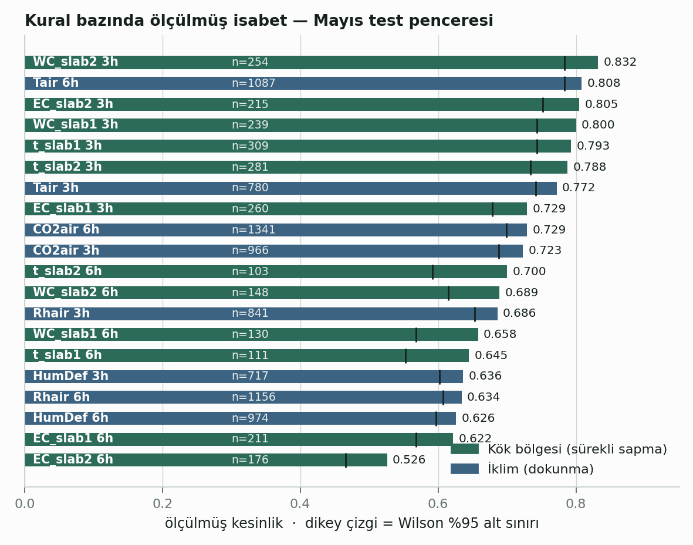
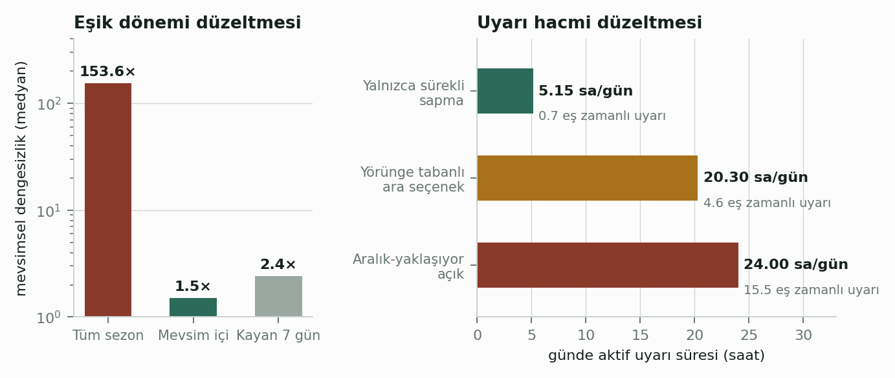
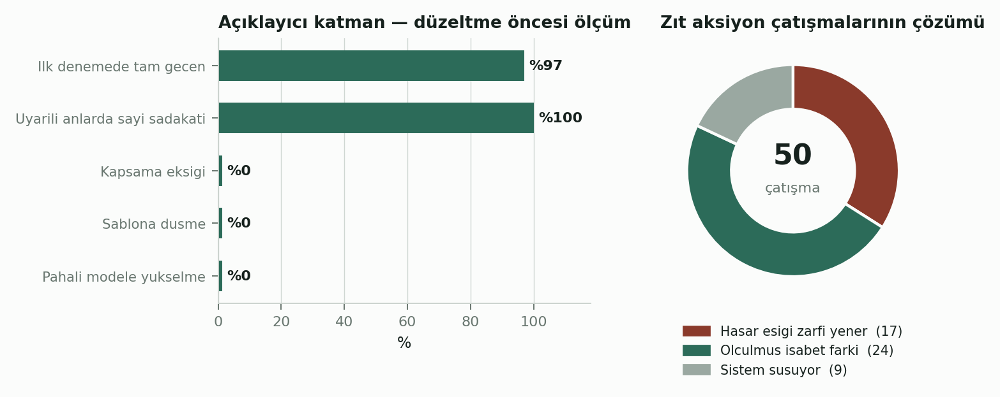
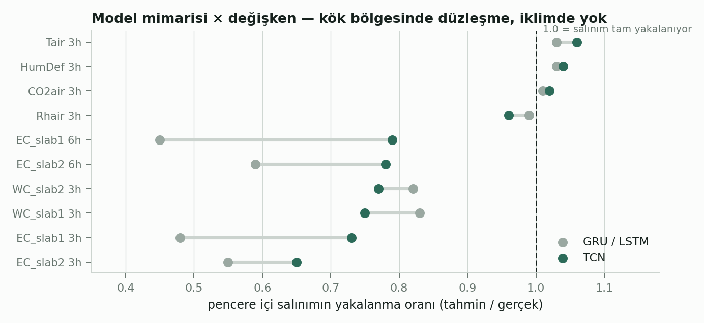

AUTONOMOUS GREENHOUSE CHALLENGE · 2. SÜRÜM VERİ SETİ

**Sera İklim ve Kök Bölgesi Karar Destek Katmanı**

Açıklayıcı ajan mimarisi, kriter–değişken hizalaması ve doğrulama

**Faz 6 · Teknik Rapor**

24 Ağustos 2026

İçindekiler

1 Yönetici Özeti

Bu rapor, Autonomous Greenhouse Challenge 2. sürüm veri seti üzerine kurulmuş tahmin katmanının üstüne yerleştirilen karar destek ve açıklama katmanını, bu katmanın doğrulanmasını ve doğrulama sırasında ortaya çıkan yapısal düzeltmeleri belgelemektedir.

Çalışmanın çıkış noktası, yol haritasında öngörülen çok ajanlı mimarinin gerekçesini veriyle sınamaktı. Sınama olumsuz sonuçlandı: ajanlar arası müzakereyi gerektirecek sinyal çatışmaları, öngörülen sıklıkta gerçekleşmemektedir. Mimari buna göre tek açıklayıcı ajana indirgenmiş, karar üretimi tümüyle deterministik bir çekirdeğe bırakılmış ve dil modelinin ürettiği her sayı, kod tabanlı bir denetleyiciyle karar kaydına karşı doğrulanır hâle getirilmiştir.

Doğrulama süreci, sistemin kapsamına ilişkin daha temel bir kusuru ortaya çıkarmıştır. İklim değişkenleri (sıcaklık, bağıl nem, nem açığı, karbondioksit), düşük ölçülmüş başarım gerekçesiyle devre dışı bırakılmıştı. İnceleme, bu başarımın değişkenlerin kendisinden değil, uygulanan uyarı kriterinin bu değişkenlerin zaman ölçeğine uymamasından kaynaklandığını göstermiştir. Kriter değişken ailesine göre seçildiğinde iklim tarafının kesinliği 0,291'den 0,698'e yükselmiş; iki değişken ailesi ölçülebilir biçimde eşit güvenilirliğe ulaşmıştır.

Katmanın kendi başarımı 30 karar anı üzerinde ölçülmüştür. Açıklayıcı ajan, düzeltme döngüsü devreye girmeden önce üretilen metinlerin %97'sinde tam geçiş sağlamış; uyarı içeren anlarda ürettiği 96 sayının tamamı karar kaydında doğrulanmıştır. Sayısal sadakat mekanizması, dil modeli tümüyle devre dışı kaldığında dahi karar yolunun değişmemesini güvence altına almaktadır.

Rapor ayrıca, sistemin ölçemediği ve iddia etmediği alanları açıkça sınırlandırır. Model nedensel değildir; aksiyonun yönü bilinir, büyüklüğü bilinmez. Kış dönemi başarımı, kronolojik veri bölmesinin yapısı gereği ölçülememiştir.

| **Konu**                   | **Sonuç**                           | **Dayanak**                                      |
|----------------------------|-------------------------------------|--------------------------------------------------|
| Kriter–değişken hizalaması | İklim kesinliği 0,291 → 0,698       | Kriter, değişkenin zaman sabitine göre seçildi   |
| Eşik dönemi düzeltmesi     | Mevsimsel dengesizlik 153,6× → 1,5× | Eşikler mevsim içi yüzdeliklerden üretildi       |
| Uyarı hacmi düzeltmesi     | 24,00 → 5,15 saat/gün               | Zayıf tetikleme dalı varsayılan olarak kapatıldı |
| Açıklayıcı katman          | İlk denemede tam geçiş %97          | Uyarılı anlarda 96/96 sayı doğrulandı            |
| Zıt aksiyon tespiti        | 50 çatışmanın 41'i çözüldü          | Ölçüm desteklemediğinde sistem öncelik bildirmez |

*Tablo 1 — Bu fazın başlıca bulguları.*

2 Kapsam ve Amaç

2.1 Bu fazın konusu

Önceki fazlarda kısa ufuklu (3 ve 6 saat) tahmin modelleri eğitilmiş, bu modellerin üzerine eşik tabanlı bir risk değerlendirme katmanı kurulmuş ve katman geçmiş veri üzerinde geriye dönük olarak sınanmıştı. Bu fazın konusu, söz konusu katmanın çıktısını insan okuyucuya aktaracak bir açıklama mekanizması kurmak ve bu mekanizmanın güvenilirliğini ölçmektir.

Çalışma sırasında, açıklama katmanının doğrulanması amacıyla yapılan incelemeler karar katmanının kendisine ilişkin dört yapısal kusur ortaya çıkarmıştır. Bu kusurlar ve düzeltmeleri raporun beşinci bölümünde ele alınmaktadır; söz konusu düzeltmeler bu fazın öngörülmemiş ancak en önemli çıktısıdır.

2.2 Kapsam dışı bırakılanlar

Sistem, aktüatörlere doğrudan kumanda etmez ve kapalı döngü denetim yapmaz. Değerlendirme, 2020 sezonuna ait geçmiş veri üzerinde geriye dönük yürütülmüştür; gerçek zamanlı işletim kapsam dışıdır. Ekonomik değerlendirme ayrı bir raporun konusudur ve burada yalnızca kapsam tartışmasında referans olarak anılmaktadır.

3 Sistem Mimarisi

Sistem üç katmandan oluşur ve yalnızca ortadaki katman bir dil modeli barındırır. Bu ayrım tasarımın temelidir: karar üretimi tümüyle deterministik bir çekirdekte gerçekleşir, dil modeli yalnızca üretilmiş kararı anlatır, üçüncü katman ise anlatının kayda sadakatini kod düzeyinde denetler.

*Şekil 1 — Katman mimarisi ve denetim geri besleme döngüsü.*

3.1 Tek ajan kararının gerekçesi

Yol haritası dört ayrı ajan öngörüyordu: izleme, risk, öneri ve açıklama. Bu ayrımın tek somut gerekçesi, çelişen sinyallerin ajanlar arası müzakereyle çözülmesiydi. Gerekçe üç ayrı ölçümle sınanmış ve doğrulanmamıştır.

| **Öngörülen çatışma** | **Ölçüm**                         | **Sonuç**                                                                     |
|-----------------------|-----------------------------------|-------------------------------------------------------------------------------|
| Sulama aktüatörü      | Sezon boyunca 0 adım              | Elektriksel iletkenlik ile su içeriği ters kuplajlı; eşzamanlı tetiklenemiyor |
| Havalandırma          | 133 adım · 8 olay · 11 saat/sezon | Mevcut, ancak tümü acil olmayan seviyede                                      |
| Karbondioksit dozajı  | 42 adım · 0,0003 €/m²             | Parasal etki ölçüm eşiğinin altında                                           |

*Tablo 2 — Çok ajanlı mimarinin gerekçesine ilişkin ölçümler.*

Ayrıca karbondioksit senaryosunun fizyolojik önkoşulu incelendiğinde, düşük karbondioksit anlarının büyük çoğunluğunda havalandırma pencerelerinin açık olduğu görülmüştür. Bu koşulda dozaj artırmak, dozlanan gazın dışarı kaçması anlamına gelir. Dozajın hem fizyolojik hem ekonomik olarak anlamlı olduğu koşul, incelenen seralardan birinde hiç gözlenmemiştir.

<table>
<colgroup>
<col style="width: 100%" />
</colgroup>
<tbody>
<tr class="odd">
<td>
<strong>SONUÇ</strong>

Müzakereyi gerektirecek bir durum yılda birkaç saatlik bir olguya karşılık gelmektedir. Bu ölçek, ajanlar arası protokol yerine üç satırlık deterministik bir öncelik kuralıyla karşılanmaktadır. Kalan iki gerekçe — doğal dilde anlatım ve “neden bu uyarı” sorusunun yanıtlanması — aynı yeteneği gerektirir ve tek ajanla karşılanır.
</td>
</tr>
</tbody>
</table>

4 Yöntem

4.1 Yapılandırma merdiveni

Düzeltmelerin etkisini ölçmek için tek bir “düzeltilmiş koşu” yerine dört koşuluk bir merdiven kurulmuştur. Her basamak bir öncekinden yalnızca tek bir değişiklikle ayrılır; böylece metrikteki farkın kaynağı tartışmasız hâle gelir. Sıfırıncı basamak, yayımlanan yapılandırmayı yeniden üretir ve karşılaştırma tabanı işlevi görür.

*Şekil 2 — Dört yapılandırma. Üstte ham metrikler, altta temel olay oranına göre kazanç.*

Ham kesinlik basamaklar boyunca düşerken şansa göre kazanç son basamakta beş katına çıkmaktadır. Bu görünürdeki çelişkinin nedeni, sürekli sapma kriterinin olay tanımını daraltmasıdır: olaylar altı kat seyrekleşir, dolayısıyla aynı kesinlik çok daha fazla bilgi taşır. Bu, ham metriklerin tek başına yorumlanamayacağını gösteren temel bir örnektir.

4.2 Girdi modu ayrımı

Değerlendirme iki ayrı girdi modu üzerinden yürütülmektedir. Oracle modunda gerçekleşmiş gelecek, tahmin yerine kullanılır; bu, tahmin hatası sıfır olsaydı karar kurallarının ne diyeceğini gösterir ve kural kalitesinin üst sınırını verir. Model modunda gerçek tahminler kullanılır ve uçtan uca başarım ölçülür. İki mod arasındaki fark, hatanın kaynağını ayrıştırır: aynı anda oracle uyarı verip model vermiyorsa kusur tahmindedir, kuralda değil.

4.3 Ölçüm bütünlüğü

Demo arayüzünde kullanılan model tahminleri, geriye dönük sınamada kullanılan model seçimiyle aynı ölçütten geçirilir: her hedef–ufuk çifti için doğrulama setinde en dar terminal aralığı veren model seçilir. Bu tutarlılık olmadan ekranda görünen sayı ile raporlanan sayı farklı sistemleri anlatırdı.

5 Bulgular

5.1 Kriter–değişken hizalaması

Bu fazın en önemli bulgusu, uyarı kriterinin değişkenin zaman ölçeğine uyması gerektiğidir. Sürekli sapma kriteri, tahmin penceresinin tamamının eşik dışında kalmasını şart koşar. Bu koşul, yavaş sürüklenen kök bölgesi değişkenleri için doğaldır; hızlı salınan iklim değişkenleri için ise neredeyse hiç gerçekleşmeyen bir durumdur.

*Şekil 3 — Solda kriter × aile kesinlikleri, sağda eşik aşımlarının süre dağılımı.*

Ölçüm, iklim değişkenlerinde eşik aşımlarının medyan süresinin on iki buçuk dakika olduğunu, aşımların yalnızca yüzde dokuzunun üç saati aştığını göstermektedir. Karbondioksitte bu oran yüzde iki virgül yediye düşmektedir. Kök bölgesinde ise medyan süre elli yedi buçuk dakikadır ve aşımların yüzde otuz yedisi üç saati aşar.

<table>
<colgroup>
<col style="width: 100%" />
</colgroup>
<tbody>
<tr class="odd">
<td>
<strong>KRİTER SEÇİMİ TEK ÖLÇÜTE DAYANMAZ</strong>

Kök bölgesinde dokunma kriteri daha yüksek kesinlik verir (0,802 · 0,722). Bu kriterin seçilmemesinin nedeni uyarı hacmidir: temel olay oranı 3,6 kat yüksektir ve ölçülen aktif uyarı süresi günde 24 saate ulaşmaktadır. Şansa göre kazanç da tek başına yeterli değildir; iklim–sürekli hücresi 24,7 kat ile en yüksek kazancı verir, ancak kesinliği 0,291'dir, yani her dört uyarıdan üçü yanlıştır. Seçim, kabul edilebilir uyarı hacminde kabul edilebilir kesinliği sağlayan hücreye göre yapılmıştır.
</td>
</tr>
</tbody>
</table>

5.2 Kural bazında güvenilirlik

Kriter ailesine göre seçildikten sonra iki değişken ailesi ölçülebilir biçimde eşit güvenilirliğe ulaşmaktadır. İsabet medyanı kök bölgesinde 0,714, iklimde 0,705'tir. Sıralamanın ikinci basamağında yer alan kural bir iklim kuralıdır.

*Şekil 4 — Yirmi kuralın ölçülmüş isabeti ve Wilson %95 alt sınırları.*

Wilson alt sınırının ayrıca gösterilmesi, az olaylı kuralların yüksek görünen isabetiyle çok olaylı kuralların dengelenmesini sağlar. Örneğin kök bölgesi kurallarının olay sayısı yüz ile üç yüz arasında değişirken, iklim kurallarında bu sayı yedi yüz ile bin üç yüz arasındadır; ham isabet karşılaştırması bu farkı gizlerdi.

5.3 Eşik dönemi ve uyarı hacmi

İki bağımsız düzeltme, sistemin operasyonel kullanılabilirliğini belirlemiştir. Birincisi eşiklerin hangi dönemden türetildiği, ikincisi zayıf bir tetikleme dalının varsayılan davranışıdır.

*Şekil 5 — Solda eşik dönemi düzeltmesi, sağda uyarı hacmi düzeltmesi.*

Eşikler tüm sezonun yüzdeliklerinden üretildiğinde, sistem anormallik yerine mevsim tespit etmektedir: kuralların yalnızca yüzde üçü tasarlandığı oranda tetiklenmiş, yüzde kırk beşi hiç tetiklenmemiş, yüzde otuz ikisi ise tasarım oranının dört katından fazla tetiklenmiştir. Mevsim içi yüzdeliklere geçildiğinde dengesizlik medyanı yüz elli üç kattan bir buçuk kata inmektedir.

Uyarı hacminde ise belirsizlik aralığının eşiğe değmesini tetikleyici sayan zayıf bir dal, uyarıların yüzde doksan beşini üretmekteydi. Bu dalın varsayılan olarak kapatılması aktif uyarı süresini günde yirmi dört saatten beş saate indirmiş, gerçek uyarılar birebir korunmuştur.

5.4 Zıt aksiyon tespiti

Sekiz karar anının elle incelenmesi, üçünde aynı sistemik eksiği ortaya çıkarmıştır: aynı aktüatörü zıt yönde süren uyarılar, tek yönlü bir öneri gibi sunulmaktaydı. Anlatıda yanlış bir cümle bulunmuyordu; karar kaydı çelişkiyi hiç taşımadığı için açıklayıcı katman da göremiyordu. Karar kaydına zıt aksiyon tespiti eklenmiştir.

*Şekil 6 — Solda açıklayıcı katman ölçümü, sağda çatışma çözüm dağılımı.*

Çatışma çözümünde öncelik sırası, hasar eşiğinin zarf eşiğini yenmesi, ardından ölçülmüş isabetin Wilson alt sınırına göre karşılaştırılması biçimindedir. İki taraf arasındaki isabet farkı 0,05'in altında kaldığında sistem öncelik bildirmez ve kararı okuyucuya bırakır. Bu, çözülen çatışma oranını yüzde doksan ikiden yüzde seksen ikiye düşürmüştür; azalma bilinçlidir.

5.5 Model mimarisi ve salınım yakalama

Tahmin katmanının pencere içi uç noktaları ne ölçüde yakaladığı, kriter seçimini doğrudan ilgilendirir; sürekli sapma kriteri pencere uç noktalarını kullanır. Ölçüm, yinelemeli mimarilerin kök bölgesi salınımını yaklaşık yarı oranında düzleştirdiğini, evrişimli mimarinin ise aynı değişkenlerde belirgin biçimde daha başarılı olduğunu göstermektedir.

*Şekil 7 — Pencere içi salınımın yakalanma oranı, mimari ve değişken bazında.*

İklim değişkenlerinde her iki mimari de bire yakın oran vermektedir. Bu bulgu, elektriksel iletkenlik kurallarının altı saatlik ufukta neden daha düşük isabet gösterdiğini açıklamaktadır: düzleşen tahmin, pencerenin tamamının eşik dışında kaldığı yönünde yanlı bir sonuç üretmektedir.

6 Doğrulama

6.1 Açıklayıcı katmanın ölçümü

Katman, altı serada otuz karar anı üzerinde ölçülmüştür. Ölçüm, düzeltme döngüsü devreye girmeden önceki ham çıktı üzerinden yapılmıştır; kabul edilen metnin sadakati tanım gereği yüzde yüzdür ve model kalitesini ölçmez.

| **Ölçü**                            | **Sonuç** | **Yorum**                                  |
|-------------------------------------|-----------|--------------------------------------------|
| İlk denemede tam geçiş              | %97       | Düzeltmesiz kabul edilen anlatı oranı      |
| **Uyarılı anlarda sayısal sadakat** | 96 / 96   | Uydurulmuş sayı bulunmamaktadır            |
| İlk denemede kapsama eksiği         | %0        | Zorunlu öğeler atlanmamıştır               |
| Şablona düşme                       | %0        | Dil modeli her koşuda denetimden geçmiştir |
| Ortalama deneme sayısı              | 1,03      | Düzeltme döngüsü nadiren devreye girmiştir |
| Pahalı modele yükselme              | %0        | Düşük maliyetli model yeterli olmuştur     |

*Tablo 3 — Açıklayıcı katmanın düzeltme öncesi ölçümü (30 an, 6 sera).*

6.2 Sayısal sadakat mekanizması

Denetleyici, üretilen metindeki her sayıyı karar kaydına karşı arar. Kayıtta bulunmayan bir sayı metni reddettirir ve eksik değerler açıklayıcı katmana geri bildirilir. Denetim yalnızca uydurmayı değil, eksik bırakmayı da yakalar: eşik, kararı veren değer, ölçülmüş isabet, hedef adı, kısıt ve nedensellik uyarısı zorunlu öğelerdir ve biri eksikse metin kabul edilmez.

<table>
<colgroup>
<col style="width: 100%" />
</colgroup>
<tbody>
<tr class="odd">
<td>
<strong>DENETLEYİCİDE BULUNAN VE DÜZELTİLEN KUSUR</strong>

Sayı ayıklama düzeni, binlik ayracı bulunmayan dört ve daha fazla haneli sayıları parçalıyordu. Bu nedenle karbondioksit (400–1500 ppm) ve ışık toplamı (0–700+) değerleri hiç doğrulanmamaktaydı. Kusur iki yönlü zarar üretir: metindeki gerçek değer bulunamayarak uydurma sayılır, ayrıca karşılaştırma havuzuna sahte değerler girerek ilgisiz sayıların kabul edilmesine yol açar.
</td>
</tr>
</tbody>
</table>

6.3 Anlam denetimi

Sayısal sadakat, cümlenin anlamının doğru olduğunu göstermez. Bir metin, bütün sayıları kayıttan alarak yine de yanlış bir önerme kurabilir. Bu nedenle sekiz uyarılı an, karar kaydı ile yan yana konarak elle incelenmiştir. Beş vaka temiz çıkmış, üç vakada zıt aksiyonların tek yönlü sunulduğu görülmüş ve bu bulgu karar kaydına zıt aksiyon tespitinin eklenmesiyle sonuçlanmıştır. İnceleme ölçeği genişletilmelidir.

7 Sınırlar

Aşağıdaki sınırlar sistemin kusurları değil, tanımlı kapsamının dışında kalan alanlardır. Her biri çıktı ekranlarında ve karar kaydında açıkça yer alır.

| **Alan**                  | **Sınır**                                                                   | **Sonucu**                                                                                                                                              |
|---------------------------|-----------------------------------------------------------------------------|---------------------------------------------------------------------------------------------------------------------------------------------------------|
| Nedensellik               | Model nedensel değildir. Aksiyonun yönü bilinir, büyüklüğü tahmin edilemez. | Sistem “ne kadar” sorusuna yanıt vermez ve vermediğini açıkça bildirir.                                                                                 |
| Kış başarımı              | Kronolojik %70/15/15 bölmesi test setini tümüyle Mayıs ayına bırakır.       | Kış ancak yeniden eğitimle ölçülebilir. Ekonomi analizi maliyetin kış döneminde belirlendiğini göstermektedir; bu, kapatılması gereken bir açıktır.     |
| Zarf eşiklerinin niteliği | Zarf eşikleri seranın kendi çalışma aralığından türetilmiştir.              | Mutlak literatür sınırı değildir. Hasar eşikleri taslak durumundadır.                                                                                   |
| Zamansal belirsizlik      | Karar kaydı, sapmanın pencere içinde hangi anda gerçekleştiğini taşımaz.    | Aynı hedefin iki yönde birden görünmesi (50 çatışmanın 2'si) eş zamanlı değil ardışık olabilir; sistem bunu ayırt edemez ve ayırt edemediğini bildirir. |
| Anlam denetimi            | Sayısal sadakat, cümlenin anlamının doğru olduğunu göstermez.               | Sekiz vakalık elle inceleme yapılmıştır; ölçek genişletilmelidir.                                                                                       |
| Örneklem yanlılığı        | Gösterim arayüzündeki anlar, uyarı yoğunluğuna göre seçilmiştir.            | Arayüzde görünen karşılaştırmalar yansız başarım ölçümü değildir; yansız değerler test penceresinin tamamı üzerinden raporlanmıştır.                    |

*Tablo 4 — Tanımlı sınırlar ve etkileri.*

8 Sonuç ve Öneriler

8.1 Ulaşılan nokta

Karar destek katmanı, her uyarısını ölçülmüş bir isabet oranıyla birlikte sunan, hangi kuralların bilinçli olarak susturulduğunu bildiren ve ürettiği her sayıyı kod düzeyinde doğrulanabilir kılan bir yapıya kavuşmuştur. Katmanın kendi başarımı ölçülmüş, ölçümün neyi göstermediği açıkça yazılmıştır.

Bu fazın en değerli çıktısı, planlanmış bir geliştirme değil, doğrulama sırasında ortaya çıkan bir kusurun düzeltilmesidir. İklim değişkenlerinin devre dışı bırakılması, bir sera iklim sistemini fiilen kök bölgesi izleyicisine indirgemekteydi. Kusurun kaynağı ölçüm aracının kendisiydi: değişkenler yanlış kriterle değerlendiriliyordu.

8.2 Öneriler

| **Öncelik** | **Öneri**                                     | **Gerekçe**                                                                                                          |
|-------------|-----------------------------------------------|----------------------------------------------------------------------------------------------------------------------|
| Yüksek      | Kış dönemi başarımının ölçülmesi              | Ekonomik analiz maliyetin kış döneminde belirlendiğini göstermektedir; mevcut test penceresi tümüyle Mayıs ayındadır |
| Yüksek      | Anlam denetimi ölçeğinin genişletilmesi       | Sekiz vakalık inceleme bir sistemik kusur ortaya çıkarmıştır; daha geniş örneklem başka kusurlar gösterebilir        |
| Orta        | Sapma zamanının karar kaydına eklenmesi       | Aynı hedefin iki yönde görünmesi hâlinde eş zamanlılık ayırt edilemiyor                                              |
| Orta        | Nem uyarılarının tekilleştirilmesi            | Bağıl nem ve nem açığı kuralları örtüşebiliyor; örtüşme serada değişiyor                                             |
| Düşük       | Belirsizlik aralığının asimetrik modellenmesi | Mevcut simetrik varsayım kalibrasyon sonuçlarını etkiler; maliyeti yüksektir                                         |

*Tablo 5 — Öncelik sırasına göre öneriler.*

Ek A Yapılandırma Envanteri

Eşik dönemi, uyarı kriteri ve hedef susturma birbirinden bağımsız parametrelerdir; olası kombinasyonların tamamı çalışır durumdadır. Seçilen yapılandırma her çıktıya damgalanır.

| **Ad**   | **Kural tabanı** | **Eşik dönemi** | **Kriter**  | **Susturulan** | **Kullanım amacı**                                    |
|----------|------------------|-----------------|-------------|----------------|-------------------------------------------------------|
| **demo** | v5               | mevsimsel       | hedef bazlı | —              | Varsayılan. Kök bölgesi sürekli sapma, iklim dokunma. |
| dar      | v5               | mevsimsel       | sürekli     | 5 iklim hedefi | Terk edildi. Karşılaştırma için korunuyor.            |
| taban    | v1               | tüm sezon       | dokunma     | —              | Yayımlanan yapılandırma. Karşılaştırma tabanı.        |
| güven    | v5               | tüm sezon       | dokunma     | —              | Merdiven adım 1.                                      |
| eşik     | v5               | mevsimsel       | dokunma     | —              | Merdiven adım 2.                                      |
| kriter   | v5               | mevsimsel       | sürekli     | —              | Merdiven adım 3.                                      |

*Tablo A.1 — Tanımlı yapılandırmalar.*

Ek B Karar Günlüğü

Bu fazda alınan tasarım kararları, gerekçeleri ve dayandıkları ölçümler.

| **Karar**                                      | **Gerekçe**                                                            | **Dayanak**                                                                    |
|------------------------------------------------|------------------------------------------------------------------------|--------------------------------------------------------------------------------|
| Çok ajanlı mimari yerine tek açıklayıcı ajan   | Müzakereyi gerektirecek sinyal çatışması öngörülen sıklıkta oluşmuyor  | Sulama çatışması 0 adım; havalandırma 11 saat/sezon; CO₂ senaryosu 0,0003 €/m² |
| Sayı denetimi ajanla değil kodla               | Karar kaydı yapılandırılmış ve sayılar sonlu; tam eşleşme aranabilir   | Denetim maliyeti sıfır, sonucu kesin                                           |
| Kriter değişken ailesine göre seçilir          | Kriterin, değişkenin zaman sabitine uyması gerekiyor                   | Aşım süresi medyanı: kök 57,5 dk · iklim 12,5 dk                               |
| İklim hedeflerinin susturulması geri alındı    | Düşük başarım kriter uyumsuzluğundan kaynaklanıyordu                   | İklim kesinliği 0,291 → 0,698; Tair 6h tüm kurallar arasında ikinci            |
| Eşikler mevsim içi yüzdeliklerden üretilir     | Tüm sezon eşikleri anormallik değil mevsim tespit ediyordu             | Dengesizlik 153,6× → 1,5×                                                      |
| Aile metrikleri birleştirilmez                 | Farklı olay tanımlarını tek paydada toplamak geçersiz                  | Kök ve iklim ayrı kriter, ayrı temel oran                                      |
| Çatışmada ölçülmüş isabet önceliklidir         | Seçim ölçütü “olasılık verilebiliyor” değil “daha çok ihtimalle haklı” | 50 çatışmanın 24'ü bu ölçütle çözüldü                                          |
| Ölçüm desteklemiyorsa sistem öncelik bildirmez | Ölçümü olmayan bir sıralamayı üretmek sahte kesinliktir                | 9 çatışmada sistem açıkça “söyleyemem” diyor                                   |

*Tablo B.1 — Karar günlüğü.*

Ek C İzlenebilirlik Matrisi

Rapordaki her sayısal değerin üretildiği bileşen ve kaynak dosya. Metinde bu matrisin dışından gelen değer bulunmamaktadır.

| **Rapordaki değer**           | **Üretildiği bileşen**      | **Kaynak dosya**                                              |
|-------------------------------|-----------------------------|---------------------------------------------------------------|
| Merdiven metrikleri (4 adım)  | agc_backtest_v3.py          | backtest_v3_merdiven.csv                                      |
| Kriter × aile kesinlikleri    | agc_backtest_v3.py          | backtest_v3_detay_2_esik.csv · backtest_v3_detay_3_kriter.csv |
| Kural bazında ölçülmüş isabet | backtest adım 2/3 birleşimi | kural_guvenilirlik.csv                                        |
| Eşik aşım süreleri            | zaman sabiti analizi        | operational_v2_combined.csv                                   |
| Mevsimsel dengesizlik         | agc_zarf_mevsimsel.py       | dkb_zarf_v2.csv                                               |
| Uyarı hacmi ölçümü            | agc_risk_motoru.py          | motor B-yaması ölçüm çıktısı                                  |
| Açıklayıcı katman ölçümü      | agc_aciklayici_ajan.py      | ajan_katmani_olcumu.csv                                       |
| Çatışma çözüm dağılımı        | agc_karar_kaydi.py          | 50 çatışmalık tarama                                          |
| Pencere içi salınım oranları  | agc_trajektori_ozeti.py     | trajektori_ozeti.parquet                                      |
| Model tahminleri (demo)       | agc_trajektori_ozeti.py     | trajektori_ozeti.parquet                                      |

*Tablo C.1 — Değer–kaynak izlenebilirlik matrisi.*

Ek D Bileşen Sürümleri

| **Bileşen**                    | **Sürüm**    | **Sorumluluğu**                                              |
|--------------------------------|--------------|--------------------------------------------------------------|
| agc_risk_motoru.py             | 2026-08-24.1 | Kural değerlendirme, hedef bazlı kriter, kararı veren değer  |
| agc_karar_kaydi.py             | 2026-08-24.7 | Yapılandırma nesnesi, aile ayrımı, öncelik ve çatışma çözümü |
| agc_dogrulayici.py             | 2026-08-24.2 | Sayısal sadakat, zorunlu kapsama, aksan katlama              |
| agc_aciklayici_ajan.py         | 2026-08-24.1 | Dil modeli arayüzü, düzeltme döngüsü, şablon geri çekilme    |
| agc_demo.py                    | 2026-08-24.4 | Gösterim arayüzü üreticisi, ön kontrol, yanıt önbelleği      |
| agc_trajektori_ozeti.py        | 2026-08-23.8 | Model tahminlerinin çapa zamanıyla çıkarılması               |
| decision_knowledge_base_v5.csv | 818 satır    | Kural tabanı: hedef × sera × mevsim × yön                    |

*Tablo D.1 — Bileşen envanteri ve sürümleri.*

Ek E Terimler Sözlüğü

| **Terim**             | **Tanım**                                                                                                                                   |
|-----------------------|---------------------------------------------------------------------------------------------------------------------------------------------|
| Dokunma kriteri       | Tahmin penceresinin herhangi bir anında eşiğin aşılması.                                                                                    |
| Sürekli sapma kriteri | Tahmin penceresinin tamamının eşik dışında kalması.                                                                                         |
| Kararı veren değer    | Kriterin eşikle karşılaştırdığı uç nokta. Terminal tahminden farklıdır ve uyarıların yaklaşık beşte birinde eşiğin ters tarafında yer alır. |
| Zarf eşiği            | Seranın kendi çalışma aralığından türetilen, mevsime özgü yüzdelik sınır.                                                                   |
| Hasar eşiği           | Literatürden alınan, mevsimden bağımsız fizyolojik sınır.                                                                                   |
| Temel olay oranı      | Olayın veri içindeki doğal sıklığı. Kesinliğin anlamlı yorumlanması için gerekli.                                                           |
| Şansa göre kazanç     | Kesinliğin temel olay oranına bölümü. Tek başına yanıltıcıdır: nadir olayları ödüllendirir.                                                 |
| Wilson alt sınırı     | Oran tahmininin %95 güven alt sınırı. Az olaylı kuralların yüksek görünen isabetini dengeler.                                               |
| Oracle girdi          | Gerçekleşmiş geleceğin tahmin yerine kullanılması. Karar kurallarının üst sınır başarımını ölçer.                                           |
| Sayısal sadakat       | Üretilen metindeki her sayının karar kaydında bulunma oranı.                                                                                |

*Tablo E.1 — Raporda kullanılan teknik terimler.*
